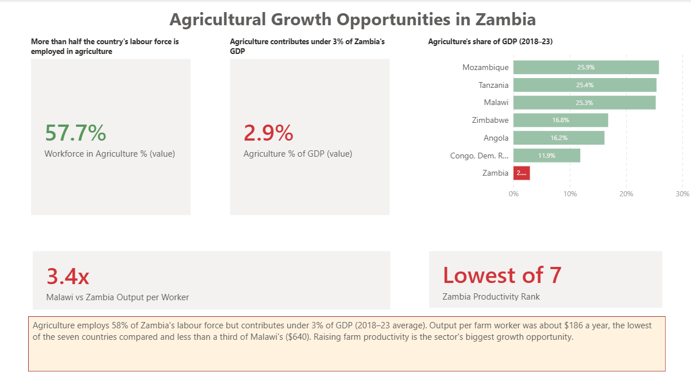
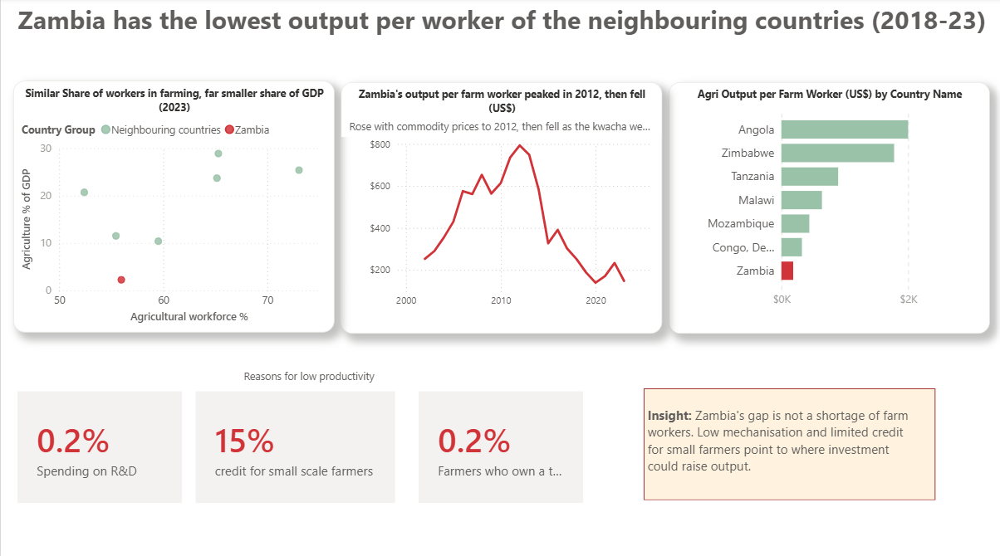
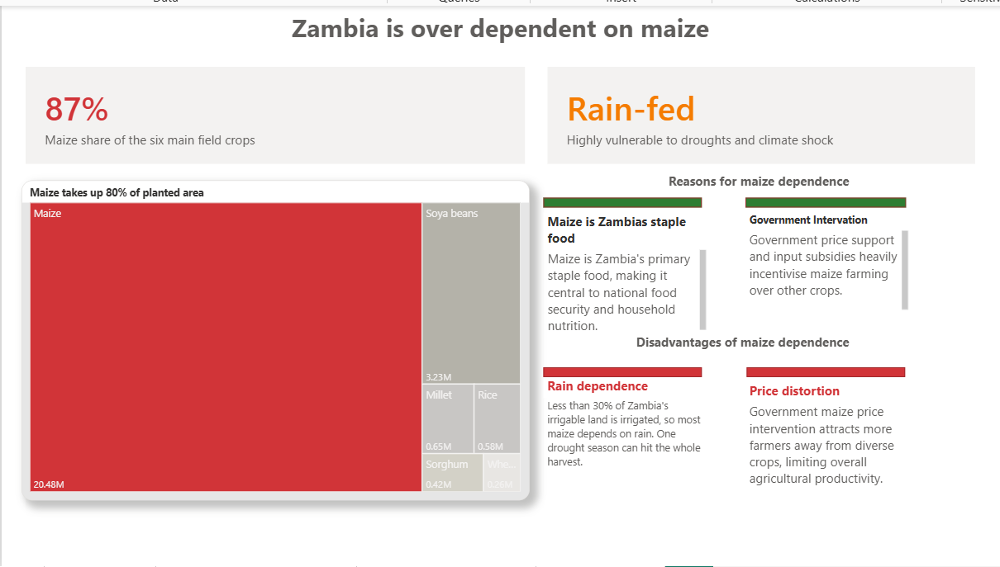
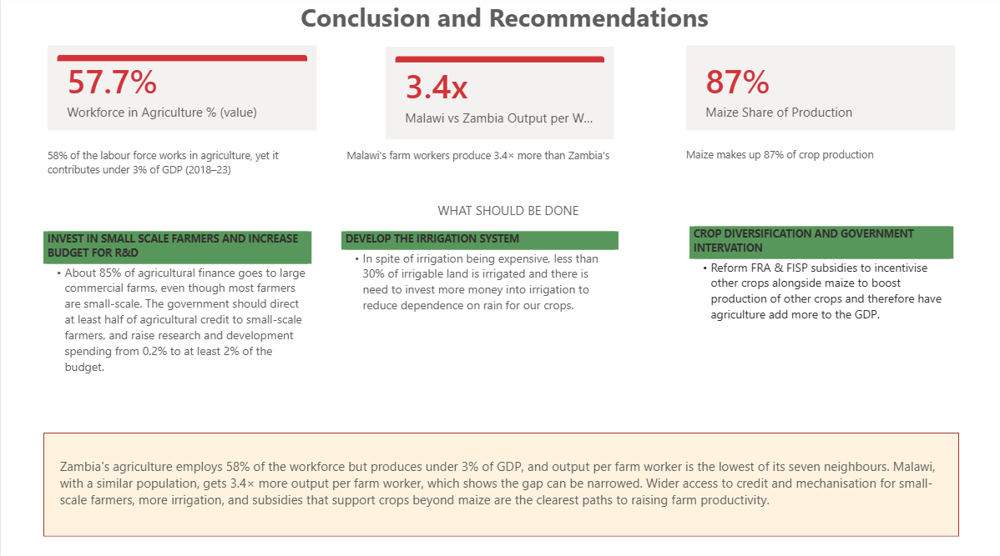

# Zambia's Agricultural Productivity Gap (Power BI)

**Tools:** Power BI (Power Query, DAX, data modelling, report design)
**Skills:** comparative analysis, KPI design, data storytelling, policy recommendations

## The question

Most Zambians who work do so in agriculture, yet farming makes up a small part of the economy. **Why, and what could change it?** I compared Zambia with six neighbouring countries (Angola, DR Congo, Malawi, Mozambique, Tanzania and Zimbabwe) to find out.

## Key findings

- **Agriculture employs 58% of Zambia's workforce but produces under 3% of GDP** (2018–23 average). Its neighbours have similar shares of people in farming, but agriculture makes up 10–29% of their GDP (2023).
- **Output per farm worker was about $186 a year, the lowest of the seven countries.** Malawi's farm workers produce 3.4× more, Tanzania's almost 5× more.
- **Zambia wasn't always last.** Output per farm worker peaked at $793 in 2012, then fell 81% by 2023. Part of that fall is the kwacha's depreciation and drought years, as the figures are in US dollars.
- **Maize dominates.** It takes up 80% of the planted area and 87% of production of the six main field crops, which leaves the harvest exposed to drought.
- **Likely constraints:** only 0.2% of farmers own a tractor, and about 85% of agricultural finance goes to large commercial farms, even though most farmers are small-scale.

## Recommendations

1. **Widen credit and mechanisation for small-scale farmers**, who make up most of the sector but receive a small share of its finance.
2. **Expand irrigation.** Less than 30% of Zambia's irrigable land is irrigated.
3. **Reform maize-focused subsidies (FRA and FISP)** so they also support other crops.
4. **Invest more in agricultural research and development.**

**Why this matters for lenders:** the underserved small-scale farmer segment is both the sector's main constraint and its largest untapped market for agricultural finance.

## Approach

1. **Data.** Downloaded World Bank World Development Indicators for the seven countries (2000–2023) and Zambian crop data (area planted and expected production for six crops, 2011–2024). Cleaned and reshaped both in Power Query.
2. **Key measure: output per farm worker.** Agricultural value added (US$) ÷ number of people working in agriculture. Built from GDP × agriculture's share of GDP, and labour force × share employed in agriculture.
3. **DAX measures:**
   - Zambia's rank among the seven countries, which updates with the year filter
   - Malawi-to-Zambia productivity ratio
   - Maize share of planted area and of production
   - Change in output per worker from Zambia's peak year to the latest year
4. **Report.** Five pages with a navigation home page: Overview, Labour Force Efficiency, Maize Dependence, and Conclusions. Headline figures use one consistent period (2018–23 average) so they can be compared.

## Limitations

- **Values are in current US dollars.** Currency swings, especially the kwacha's fall after 2014, affect comparisons over time.
- **GDP share is sensitive to the size of other sectors.** Zambia's large mining sector makes agriculture's share look smaller than it would otherwise.
- **The likely constraints (credit, mechanisation, irrigation) come from published research, not from this dataset.** The report shows *where* Zambia lags, not proof of *why*.
- **The maize share covers six main field crops only**, not cassava, groundnuts or cotton.

## Files

| File | Contents |
|---|---|
| `Zambia_Agriculture_PowerBI_Report.pbix` | The full report (data included; opens in Power BI Desktop) |
| `images/` | Screenshots of each page |

## Sources

- World Bank, World Development Indicators
- Zambian crop data: area planted and expected production for six main field crops, 2011–2024
- International Growth Centre (2024), [How to unlock Zambia's agricultural potential](https://www.theigc.org/blogs/how-unlock-zambias-agricultural-potential)
- African Development Bank / African Water Facility (2016), smallholder irrigation study
- IAPRI / Michigan State University (2013), [A Review of Zambia's Agricultural Input Subsidy Programs](https://ageconsearch.umn.edu/record/162438/files/wp77.pdf)

## About this project

I chose this topic for the final Power BI assignment of my data analytics bootcamp. I later revisited it, with help from an AI assistant (Claude), to:

- replace hard-coded figures with DAX measures calculated from the data
- correct the productivity comparison and put all headline figures on the same period
- check the written claims against published sources, and remove the ones I couldn't support
